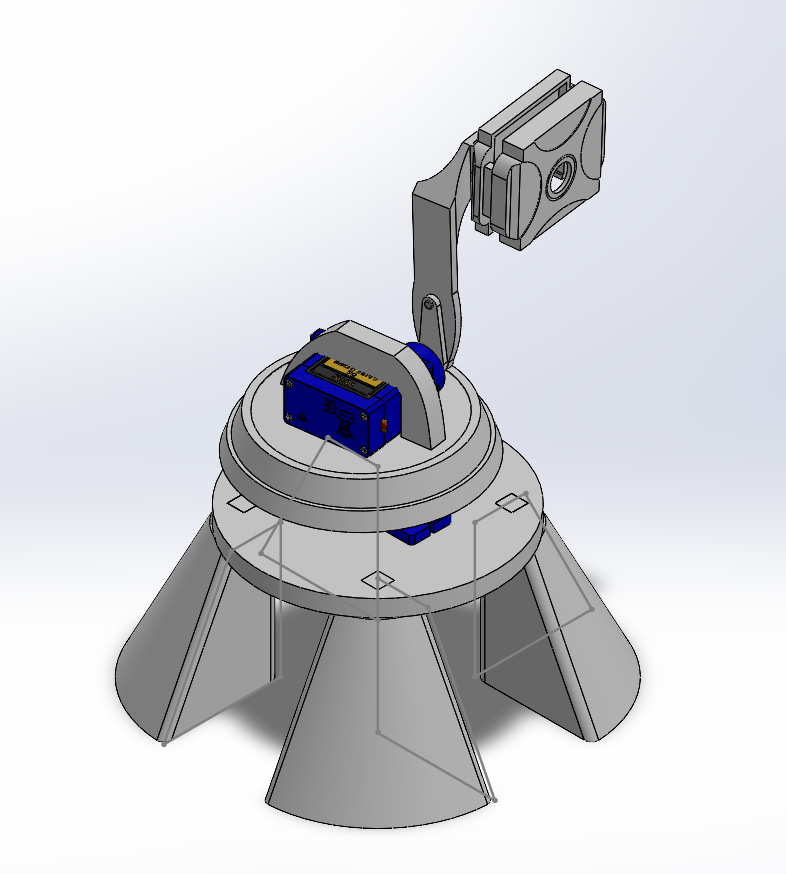

# Hardware Design – Pan–Tilt Tracking Platform

## Overview
This hardware system supports a camera-based real-time tracking pipeline by providing
a two-axis pan–tilt mechanism driven by SG90 servos. The design prioritizes stability,
repeatability, and ease of integration with Raspberry Pi-based control software.

## Components
- 2× SG90 servos (pan + tilt)
- Raspberry Pi camera module 
- Custom-designed 3D printed pan–tilt setup (SolidWorks)
- Fasteners (M3 hardware)
- Base mount (desk)

## Mechanical Architecture
The system consists of a fixed base, a pan stage driven by a horizontal-axis servo,
and a tilt stage mounted orthogonally to allow vertical tracking. The camera bracket
is aligned to minimize offset between optical axis and rotation axes.

## CAD Files
- Native SolidWorks files: `hardware/cad/`
- Neutral exports (STL): `hardware/exports/`
- Manufacturing drawings: `hardware/drawings/`

## Design Considerations
- Minimized backlash in servo mounts + DFA 
- Camera alignment to reduce control error + DFA
- Structural stiffness to limit vibration + DFA
- Fastener accessibility for rapid iteration + DFA

## Assembly
See exploded view for assembly below, schematics in other files.

## Future Improvements
- Bearing-supported pan axis
- Higher-torque digital servos
- Enclosure for cable management
- Vibration damping
